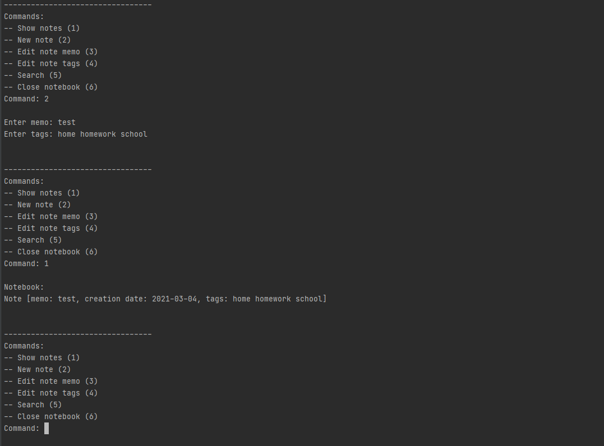

## Notebook
**Python module that allows you to use a simple notebook**

#### Start
1) All needed libraries for the projects you can find in requirements.txt
2) Open main.py
3) Run main.py

#### Using
All commands you can use in simple console interface

#### Screenshots
